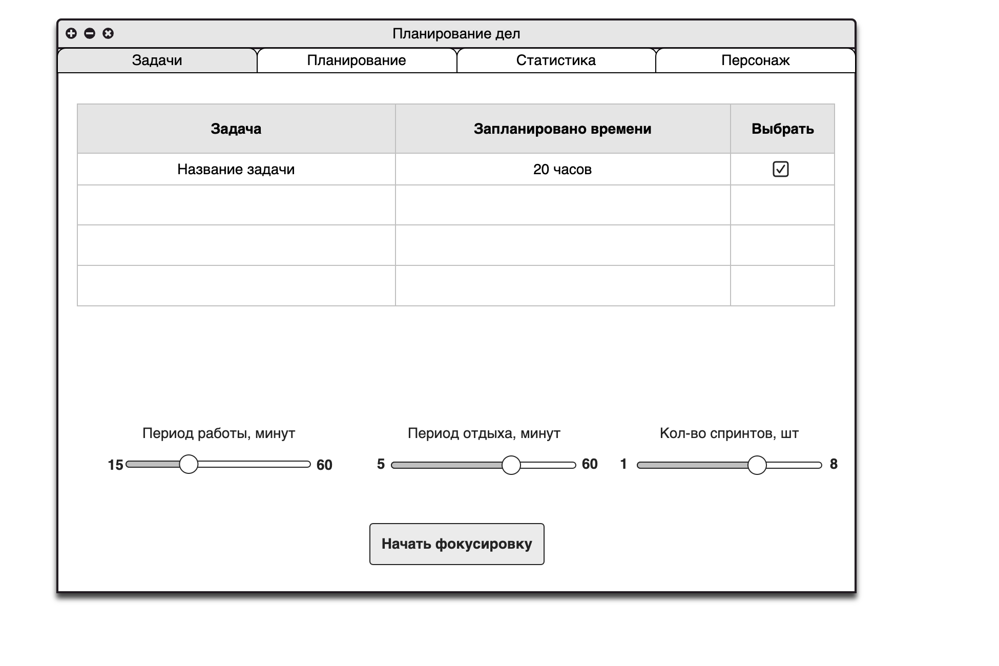
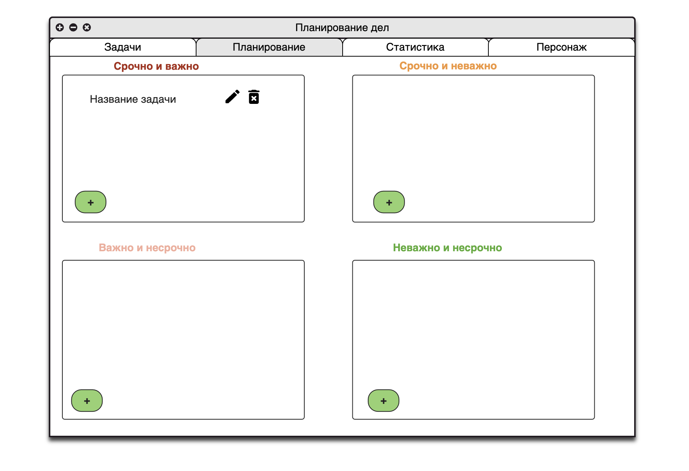
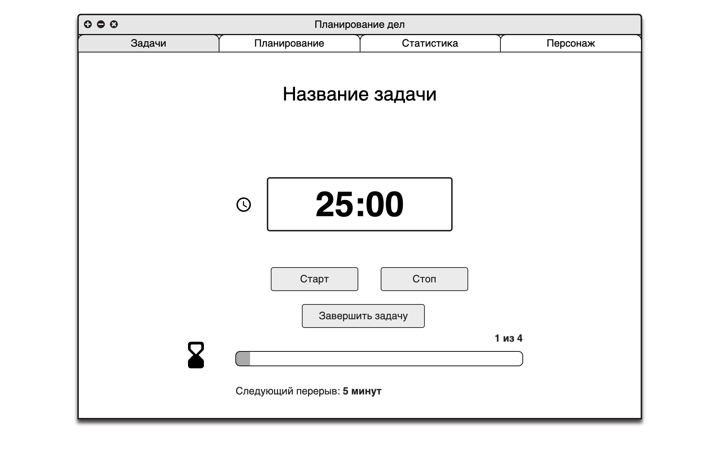
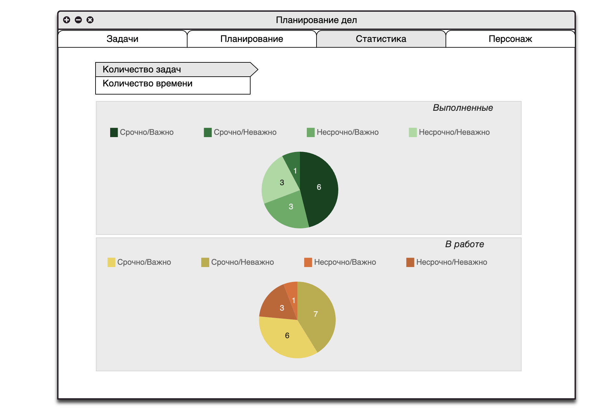
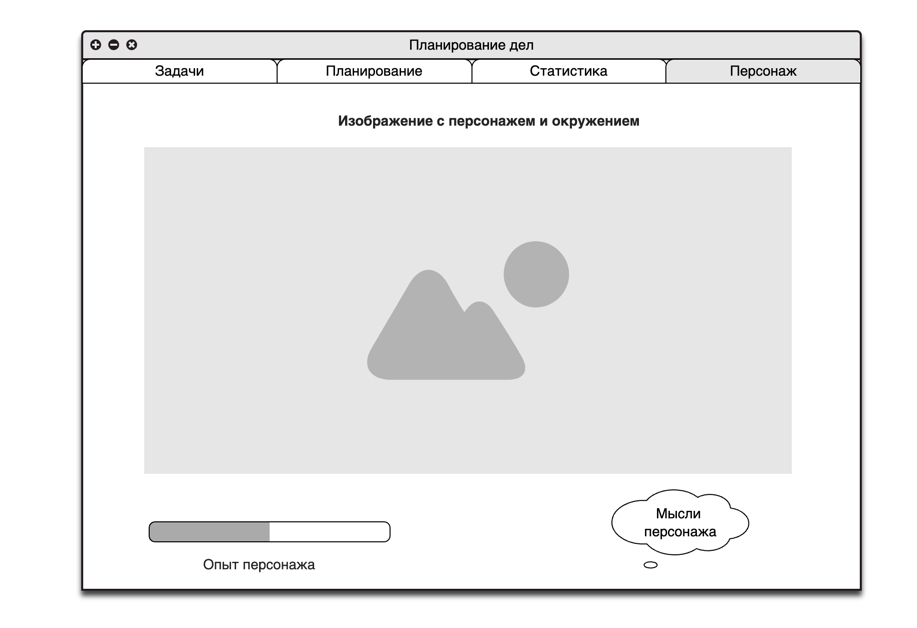

## Основное назначение

Планирование собственных задач в виде комбинации системы фокусирования Помодоро и  Матрицы Эйзенхауэра с элементами геймификации.

## Какие проблемы решает?

Данное приложение создается с целью упростить краткосрочное и среднесрочное планирование путем декомпозиции до маленьких задач и принудительного разделения по категориям с дальнейшим фокусом на них. Элемент развития персонажа необходим для мотивации и подкрепления позитивных эмоций от достижения собственных результатов.

## Технические требования
- Реализовано приложением под десктоп 
- Язык программирования и стек: Python 3.9 и выше + PyQT
- Хранение данных пользователя хранится локально в папке приложения с помощью SQlite
## Функциональные требования

### Разделы приложения

##### 1. Задачи

1. Список задач с автоматической сортировкой в порядке матрицы Эйзенхауэра:
	1. Важные срочные задачи
	2. Срочные неважные задачи
	3. Важные несрочные задачи
	4. Неважные несрочные задачи
2. Рядом с каждой задачей есть кнопка запуска режима фокусировки 
3. Если имеется запущенный фокус на задачу, то другие задачи не могут быть запущены для работы
4. При запуске задачи из категории ниже по приоритету: несрочной и неважной при наличии важной и срочной выводится предупреждение
	1. На экране 3 слайдера для определения времени на спринт, отдых и кол-во спринтов:
		1. Кол-во минут на спринт от 15 до 60
		2. Кол-во минут отдыха от 5 до 60
		3. Кол-во спринтов от 1 от 8
		Нет возможности выставить время спринтов и количество больше чем запланированно на задачу.
	
##### 2. Планирование

1. Окно разделено на 4 секции:
	1. Важные срочные задачи
	2. Срочные неважные задачи
	3. Важные несрочные задачи
	4. Неважные несрочные задачи
2. Каждая секция не отображает больше 4 задач
3. Задачи внутри секций отсортированы в порядке создания
4. Каждую задачу можно отредактировать или удалить:
	1. редактируется название, количество часов и описание.
5. Внизу каждой секции есть кнопка создания задачи:
	**Задача**:
		- Название - текстовое поле, максимум 100 символов
		- Краткое описание - текстовое поле, максимум 300 символов
		- Количество часов на выполнение - положительное число <= 8 для мотивации декомпозиции

##### 3. Статистика
1. Отображется две зоны со статистикой по выполненным задачам и текущим задачам.
2. Статистика по выполненным отображает круговые диаграммы:
	- Кол-во выполненных задач по секциям важности/срочности
	- Кол-во потраченного времени на задачи по секциям важности/срочности
3. Статистика по текущим задачам отображает:
	- Кол-во невыполненных задач по секциям важности/срочности
	- Кол-во запланированного времени на каждую секцию важности/срочности
##### 4. Страница персонажа
1. Отображает графическое изображение персонажа
2. Отображает прогресс-бар с опытом персонажа
3. Отображение персонажа изменяется в зависимости от опыта персонажа на каждые пять уровней, текущий максимум - 20 уровней
4. Отображаются мысли персонажа:
	1. Если решена задача, то позитивная фраза с похвалой
	2. Если в течение 24 часов не решена ни одна задача, то фраза в негативной/усталой окраске
##### 5. Фокусировка
1. Отображается таймер текущего спринта
2. Две кнопки для начала/паузы режима фокусировки
3. Отображается информация по номеру спринта из общего количества
4. Отображается прогресс-бар для времени текущего спринта
5. Отображается время на следующий перерыв
6. В заголовке вкладки название задачи
7. При переключении вкладки таймер останавливается
8. Есть кнопка "Завершить задачу", которая записывает задачу с потраченным на нее временем в архив.

## Пользовательские сценарии
1. Распланировать задачи по категориям:
Пользователь запускает приложение -> 
открывает вкладку "Планирование" ->
Выбирает подходящую секцию из 4 доступных ->
Нажимает кнопку добавления ->
Вводит данные по задаче(название, описание, время на выполнение) ->
Переходит во вкладку "Задачи" и видит отсортированные в более эффективном порядке задачи

2. Сфокусироваться на задаче
Пользователь запускает приложение ->
Открывает вкладку "Задачи" ->
Выбирает с помощью слайдеров необходимый режим работы и отдыха ->
Выбирает задачу для работы с помощью галочки рядом с ней ->
Запускает фокусировку ->
Нажимает кнопку "Старт" и таймер начинает отсчитывать время работы над задачей ->
По окончанию спринта начинается период паузы с помощью кнопки "Отдых" ->
Далее по нажатию кнопки "Старт" продлжается работа над задачей пока пользователь не нажмет "Закончить задачу" ->
Если время не хватило пользователь может добавить спринты, пока не завершит задачу или не упрется в потолок 8 часов

3. Просмотр статистики решенных и запланированных задач
Пользователь запускает приложение ->
Открывает вкладку "Статистика" ->
Выбирает переключатель "Задачи" в окне вкладки ->
Система отображает круговую диаграмму по решенным и запланированным задачам

4. Получение информации по уровню своего персонажа:
Пользователь завершает задачу ->
Получает всплывающее окно о получении опыта за решенную задачу ->
Переходит во вкладку "Персонаж" ->
Система отрисовывает прогресс-бар с кол-вом опыта и текущим уровнем персонажа и мыслями по поводу решенной задаче->
Если опыт превысил текущий уровень, то он повышается с уведомлением пользователя ->
Если уровень кратен 5, то сменяется отображение персонажа и окно с его мыслями

5. Создание задачи
Пользователь запускает приложение -> 
открывает вкладку "Планирование" ->
Нажимает кнопку "+" в необходимой секции ->
Заполняет поля задачи ->
Система валидирует пользовательский ввод после каждого введенного поля->
Если допущены ошибки, то высвечивается сообщение о неправильных данных ->
После успешного создания окно планирования обновляется данными с новой задачей

6. Просмотр актуальных задач
Пользователь запускает приложение -> 
открывает вкладку "Задачи" ->
Система группирует задачи по степени важности и сортирует по убыванию важности/срочности и дате создания ->
Пользователь видит отрисованный список с задачами, где самые приоритетные - важные и срочные, созданные раньше всего и с большим временем на решение

## Макеты UI

- раздел задач

- раздел планирования

- раздел фокусировки

- раздел статистики

- раздел персонажа

